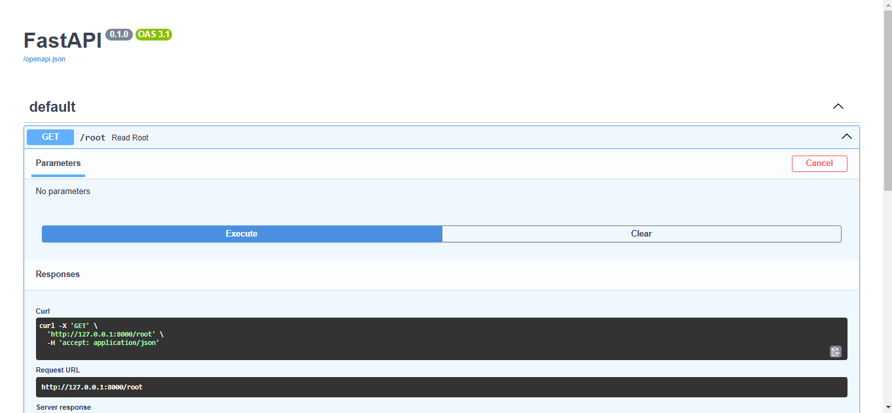
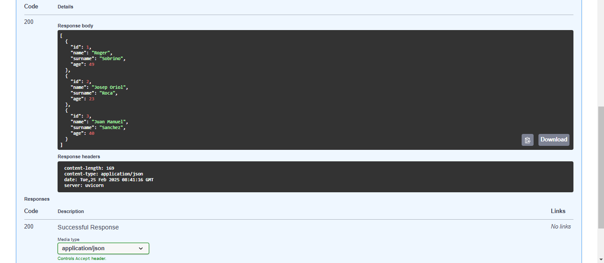

# SGE_TheBear_GrupC

Les imatges mostren la prova de l'endpoint GET /root a FastAPI amb Swagger UI. A la primera, s'executa la sol·licitud, i a la segona, es veu la resposta JSON amb dades de tres persones i les capçaleres de la resposta.