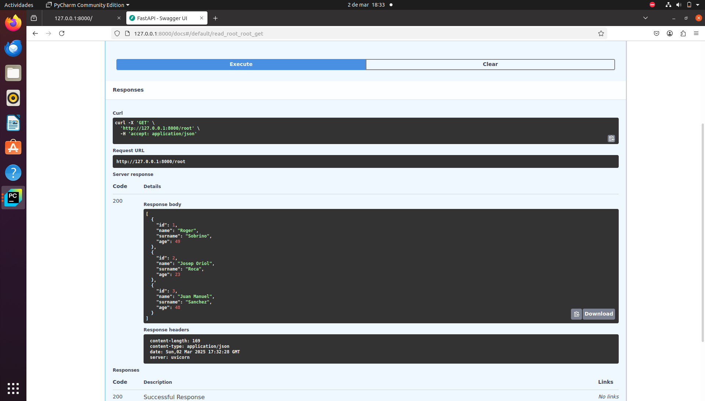
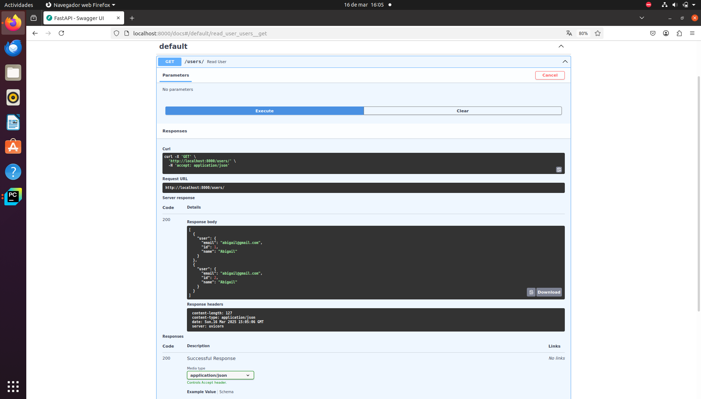
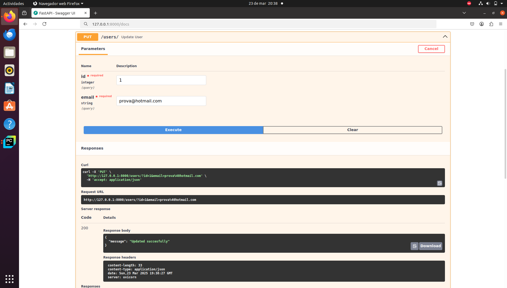

# SGE_TheBear_GrupC
Nom del projecte: SGE_TheBear_GrupC

Integrants:
- Estefania Rubiano 
- Abigail Cáceres
- Xiomara De la Cruz
- Alba 

Pleanteament del problema: Hem agafat el nostre projecte amb the bear i amb l'ajuda de Fastapi hem generat una documentació interactiva de les dades que voliem visualitzar doncs:
El nostre proces per executar el servei ha resultat:

La nostre interficie amb la informació:

Aquest projecte utilitza FastAPI per crear una API web que permet gestionar usuaris a través de dues operacions principals: 
POST per afegir nous usuaris i 

GET per veure els usuaris ja emmagatzemats a la base de dades

A través d'un endpoint PUT, l'usuari pot modificar el seu correu electrònic mitjançant el seu ID. L'endpoint retorna un diccionari amb un missatge que indica si l'actualització ha estat correcta

