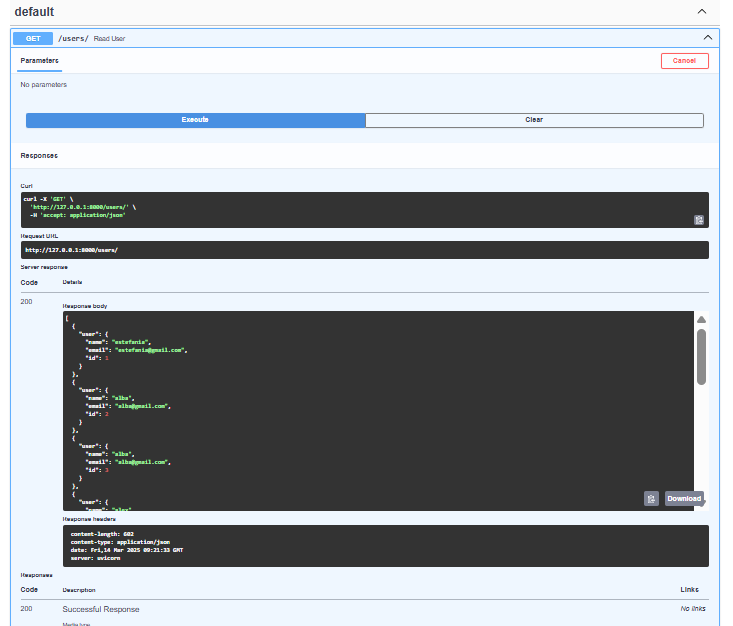
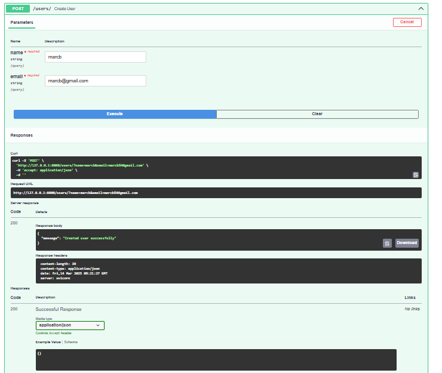
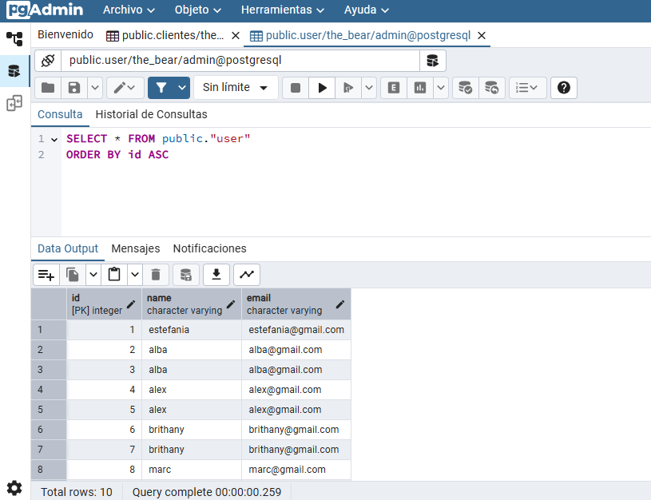

# SGE_TheBear_GrupC

## PRIMERES PASSES

Les imatges mostren la prova de l'endpoint GET /root a FastAPI amb Swagger UI. A la primera, s'executa la sol·licitud, i a la segona, es veu la resposta JSON amb dades de tres persones i les capçaleres de la resposta.

## FASTAPI + DB

### 1. Endpoint GET /users
Aquesta captura mostra el resultat de realitzar una sol·licitud GET a l'endpoint /users. La sol·licitud recupera la llista d'usuaris emmagatzemats a la base de dades. A la imatge es pot veure la resposta en format JSON, on cada usuari té atributs com id, name i email. Aquesta prova verifica que el sistema pot recuperar correctament les dades des de la base de dades PostgreSQL.

### 2. Endpoint POST /users
En aquesta captura es mostra l’ús de l’endpoint POST /users, que permet afegir un nou usuari a la base de dades. S’ha enviat una sol·licitud amb un cos en format JSON que inclou el nom, cognom i correu electrònic de l’usuari. La resposta mostra l’usuari acabat de crear, incloent-hi el seu id generat automàticament. Aquesta prova confirma que el sistema pot emmagatzemar nous usuaris de manera correcta a la base de dades.

---
### Resultats
En aquesta captura es mostra el resultat del mètode POST

